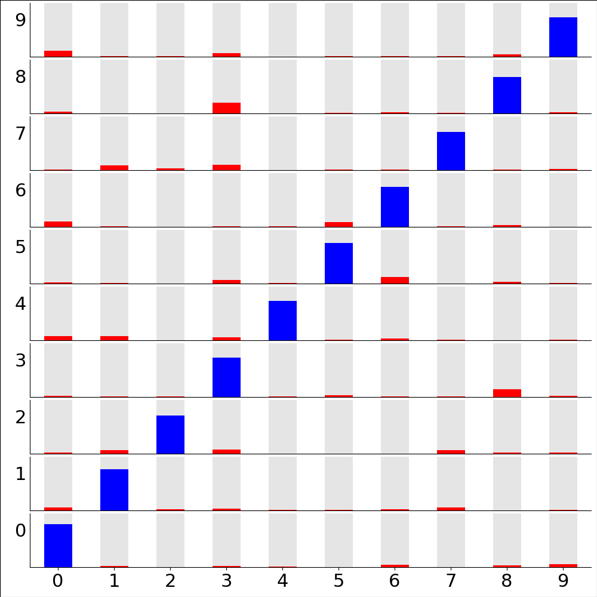

Transcription accuracy by digit
===============================

   Probability distribution of digits from the test dataset, as transcribed by the deep-convolutional transcriber after 200 epochs training. Partitioned by correct answer (vertical axis) and transcribed value (horizontal axis). That is, the bottom left are digits that are really '0' and are transcribed as '0', bottom right - digits that are really '0' but are transcribed as '9', top left - digits that are really '9' but are transcribed as '0', ...

Code to make figure

.. literalinclude:: ../../../models/ATB2_DCT/validation/PvP.py

