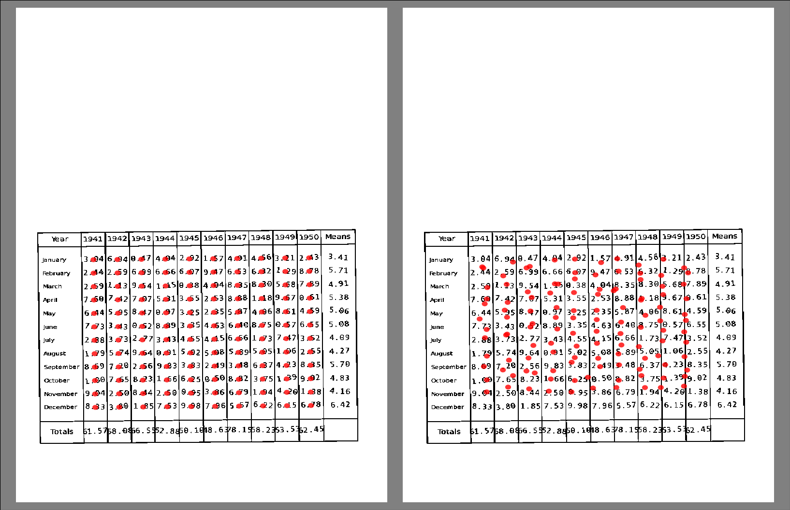

Finding data locations on the page
==================================

Ideally we'd like to know the location on the page of each rainfall datum - can we build a model to find that from the image?

   Data locations for one member of the transfer-learning dataset: true locations on the left, locations produced by an ML model from the image on the right

This requires an extension to the :doc:`training dataset <../../training_data/itp>`: as well as the image tensors already in the dataset, we need, for each image,  a training target that is a tensor containing the page coordinates of each datum grid-point:

.. toctree::
   :maxdepth: 1

   Script to make a tensor of the grid-points <../../training_data/to_tensors/grid_to_tensor>
   Script to do this 10,000 times (once for each training image)<../../training_data/to_tensors/all_grid>

Then we specify a deep convolutional model with the images as input and the datum locations as output, and fit it as before. 

.. toctree::
   :maxdepth: 1

   Model specification <transcriberModel>
   Model fit script <training>

Then we need to see if it works. There are two validation checks needed: the first to see how it does on the validation subset of the transfer-learning dataset on which it has been trained, and the second (harder) to see how well its skill transfers across to the real dataset.

.. toctree::
   :maxdepth: 1

   Training-dataset validation <validation>
   Real-dataset cross-validation <cross-validation>

So far this is neither a success or a failure - it definitely has some skill in finding the locations, but it's very imprecise. Encouragingly, there is some skill for the real dataset as well as the training dataset, so the learning transfer is working, but it's nothing like precise enough to use - more work is required.

