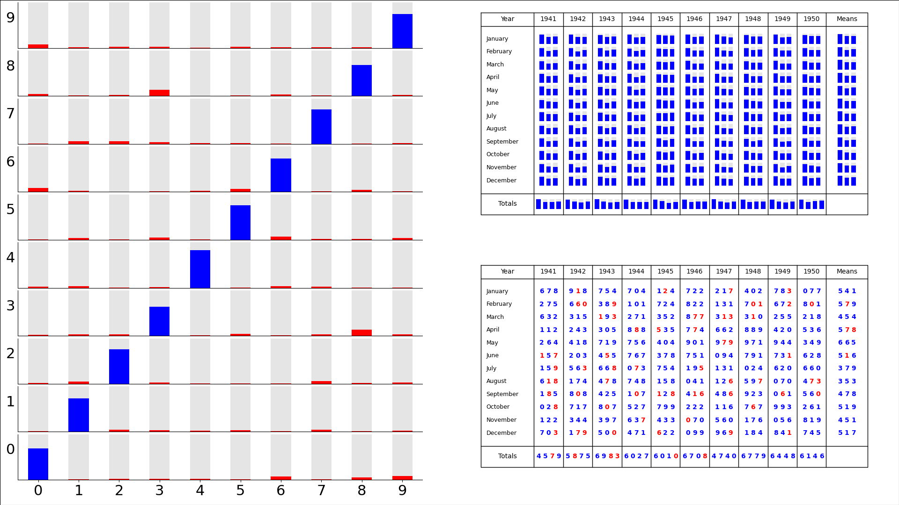

Tuned convolutional transcriber: training summary
=================================================

.. seealso:: :doc:`Video version <summary_video>`

   Validation summary after 10 epochs.

On the left, Probability distribution of digits from the test dataset, as transcribed by the model, partitioned by correct answer (vertical axis) and transcribed value (horizontal axis). That is, the bottom left are digits that are really ‘0’ and are transcribed as ‘0’, bottom right - digits that are really ‘0’ but are transcribed as ‘9’, top left - digits that are really ‘9’ but are transcribed as ‘0’, …

Top right - Mean probability of correctness for digits from the test dataset, partitioned by location in the image.

Bottom right -  the most-likely digit in each location for a single test case . Digits in blue are correct, in red mistakes.

|

Code to make the figure
-----------------------

.. literalinclude:: ../../../models/ATB2_retuned/progress_video/make_frame.py
