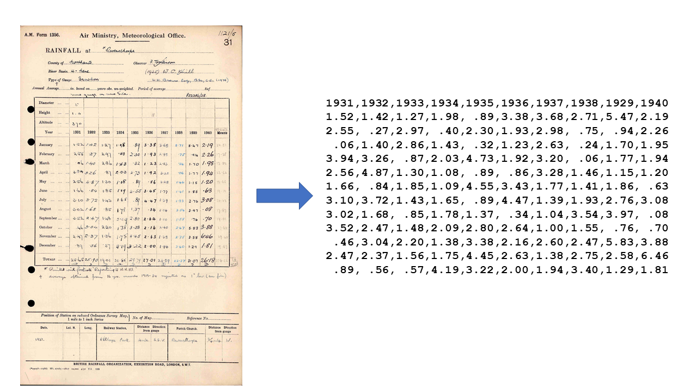
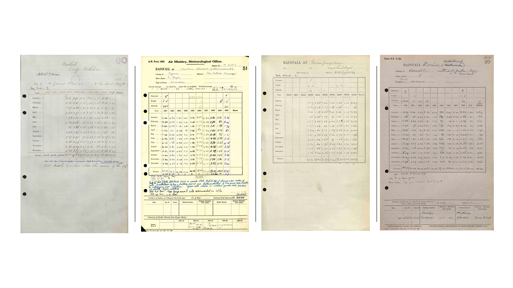

The problem: paper to digital
=============================

   How can we do this: image to text conversion, 1,000,000 times, quickly and cheaply?

This is easy for humans, but it's laborious and slow. We need a software solution. Optical Character Recognition (OCR) software does not work well, and is a poor tool for this task in any event - here we need not only to recognise the characters, but to find where on the page the data of interest are, and to preserve the structure of the data table in the output. We also need to cope with variations - the images are not all exactly the same:

So we need to create software that is powerful enough to find the grid and transcribe the digits from each image, flexible enough to cope with the many slightly-different image formats and colours, and adaptable enough that it can be re-purposed to transcribe records from other document types with different formats.

This is a staggeringly difficult task, but deep-learning methods have demonstrated remarkable capability on other difficult tasks in the general field of image analysis, can we use deep-learning for transcription?

